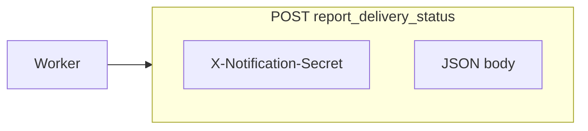
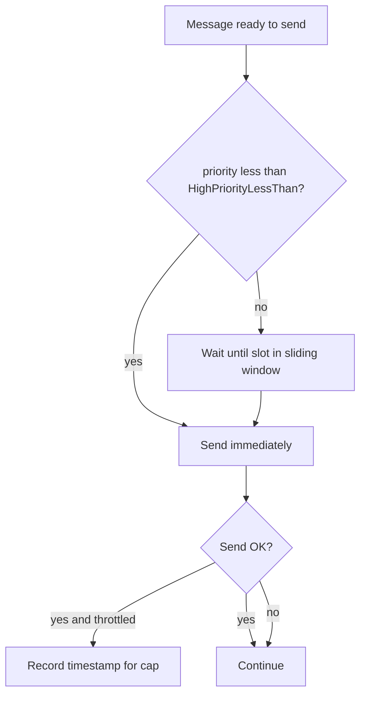

# Architecture: WhatsApp Message Sender

## Overview

The **WhatsApp Message Sender** is a .NET 9 background worker that consumes
notification messages from a configurable message broker (Redis Streams **or**
Azure Service Bus), sends them via WhatsApp Web (Selenium), tracks delivery
status, and optionally downloads file attachments from Azure Blob Storage.

The worker now runs under the generic host lifecycle (`host.RunAsync`) so it
starts and stops through `IHostedService` semantics instead of interactive
console input.

The active broker is selected by a single `MessageBroker` setting in
`appsettings.json`; no code changes are needed to switch between brokers.

For a step-by-step runtime walkthrough, see `docs/runtime-flow.md`.

---

## System Context

```
┌────────────────────────┐   XADD / Send   ┌────────────────────────┐
│  Frappe / ERPNext      │────────────────▶│  Redis Streams  (OR)   │
│  (Python producer      │                 │  Azure Service Bus      │
│   + RQ Workers)        │                 └───────────┬────────────┘
└────────────────────────┘                             │ XREADGROUP / RegisterMessageHandler
                                           ┌───────────▼───────────────────────────┐
                                           │          IMessageProcessor             │
                                           │  RedisStreamProcessor (Redis)  OR      │
                                           │  QueueProcessor       (ServiceBus)     │
                                           └──┬──────────────────┬─────────────────┘
                                              │                  │
                                    ┌─────────▼──┐    ┌──────────▼───────────────┐
                                    │  WhatsApp  │    │  Azure Blob Storage      │
                                    │  Web       │    │  (optional attachments)  │
                                    │ (Selenium) │    └──────────────────────────┘
                                    └─────────┬──┘
                                              │
                                    ┌─────────▼──────────────┐
                                    │  Frappe Message        │
                                    │  Tracking API          │
                                    └────────────────────────┘
```

---

## Broker Selection

Set `MessageBroker` in `appsettings.json` (or an environment variable) to
choose the active transport layer. Only the matching configuration block needs
to be populated.

```json
{
  "MessageBroker": "Redis",   // ← or "ServiceBus"
  "Redis": { ... },
  "ServiceBus": { ... }
}
```

| Value          | Processor class        | Transport          |
|----------------|------------------------|--------------------|
| `"Redis"`      | `RedisStreamProcessor` | Redis Streams      |
| `"ServiceBus"` | `QueueProcessor`       | Azure Service Bus  |

---

## Redis Streams delivery model (RQ + Redis Streams hybrid)

### Why this combination?

| Concern                        | Component                                |
|--------------------------------|------------------------------------------|
| Ordered, durable message store | Redis Streams (`XADD` / `XREADGROUP`)    |
| At-least-once delivery         | Consumer groups + Pending-Entry-List     |
| Delayed / scheduled retries    | Redis Sorted Set (RQ-style scheduler)    |
| Dead-lettering                 | Dedicated dead-letter stream             |

### Message lifecycle

```
Producer
  │
  │ XADD stream-<tenant> *  message_type whatsapp  message_name <name>  …
  ▼
Redis Stream  ──── XREADGROUP ──▶  RedisStreamProcessor
                                        │
                                   ┌────┴──────────┐
                              Success           Failure / Exception
                                │                    │
                             XACK             XACK + ZADD stream:retries
                                              (score = retry_after_unix_ts)
                                                     │
                                          (10 s ticker checks ZRANGEBYSCORE)
                                                     │
                                              XADD stream back (retry_count++)
                                                     │
                                         retry_count > MaxRetries?
                                              │             │
                                             No            Yes
                                              │             │
                                         (loop)    XADD stream:dead + XACK
```

### Redis keys used per stream

| Key                         | Type          | Purpose                                      |
|-----------------------------|---------------|----------------------------------------------|
| `stream-<tenant>`           | Stream        | Primary message pipeline                     |
| `stream-<tenant>:retries`   | Sorted Set    | Scheduled retries (score = Unix retry time)  |
| `stream-<tenant>:dead`      | Stream        | Dead-lettered / exhausted messages           |

---

## Azure Service Bus delivery model

The `QueueProcessor` uses Service Bus topic subscriptions plus an in-memory
priority dispatcher:

- **Lock-based at-least-once delivery** — messages remain locked until
  `CompleteAsync` (success) or `AbandonAsync` (retry).
- **Cross-topic priority** — messages from all configured subscriptions are
  enqueued to a shared priority queue; auth topics are processed first.
- **WhatsApp send rate cap (low priority)** — topics/streams with dispatch
  priority **≥ `WhatsAppSendRateLimit:HighPriorityLessThan`** (default 10) reserve
  at most **`MaxSendsPerMinute`** send slots per rolling minute (default 20).
  Priorities **&lt; 10** bypass the cap and proceed immediately when they reach
  the head of the queue.
- **Single-send guarantee** — even with multiple subscriptions and concurrent
  callbacks, only one WhatsApp send is executed at a time.
- **Native retry** — `AbandonAsync` returns the message to the queue; the
  Service Bus visibility timeout governs the retry interval.
- **Dead-letter** — after `MaxDeliveryCount` (configurable on the queue) or
  when the app explicitly calls `DeadLetterAsync`, the message moves to the
  associated dead-letter queue.

> **Important:** Although Service Bus can dispatch multiple callbacks in
> parallel (`MaxConcurrentCalls`), actual Selenium-based sends are serialized
> with a process-level semaphore to protect the single browser session.

---

## Runtime lifecycle and concurrency model

### Host lifecycle

- `Program.cs` registers a `ProcessorHostedService`.
- On application start, `ProcessorHostedService.StartAsync` calls
  `IMessageProcessor.StartProcessing()`.
- On shutdown (`SIGTERM`, Ctrl+C, orchestrator stop), `StopAsync` awaits
  `IMessageProcessor.CloseAsync()` to allow a graceful drain.

### Why send operations are serialized

Both processors use one shared `IWhatsAppService` (Selenium/ChromeDriver).
Concurrent access to one browser driver can corrupt state (active chat tab,
typed message, attachment context). To prevent that:

- Message fetch and broker-level handling can still run concurrently.
- The final `SendMessageAsync` call is guarded with `SemaphoreSlim(1,1)`.
- Result: per-process WhatsApp sends are one-at-a-time and deterministic.

This approach favors correctness over peak throughput for Selenium-based
automation. To use several WhatsApp numbers, run several service instances and
assign each instance a unique `WhatsApp:ProfilePath`; see
[`multi-instance-services.md`](multi-instance-services.md).

---

## Key abstractions

| Interface                | Implementations                                     | Purpose                                  |
|--------------------------|-----------------------------------------------------|------------------------------------------|
| `IMessageProcessor`      | `RedisStreamProcessor`, `QueueProcessor`            | Broker-agnostic consumer lifecycle       |
| `IWhatsAppService`       | `WhatsAppService` (Selenium)                        | Mockable WhatsApp sender                 |
| `IBlobStorageService`    | `BlobStorageService` (Azure SDK)                    | Mockable file downloader                 |
| `IMessageTrackingService`| `MessageTrackingService` (HTTP/Frappe API)          | Mockable status tracker                  |

---

## Configuration reference

### Common settings

```json
{
  "MessageBroker": "Redis",
  "BlobStorage":   { "ConnectionString": "…" },
  "WhatsApp":      { "ProfilePath": "…", "ChromeDriverPath": "…", "StartupWaitSeconds": 120 },
  "MessageTracking": { "ApiUrl": "…", "NotificationSecret": "…" },
  "WhatsAppSendRateLimit": {
    "Enabled": true,
    "HighPriorityLessThan": 10,
    "MaxSendsPerMinute": 20
  }
}
```

### Redis-specific settings

```json
"Redis": {
  "ConnectionString":           "localhost:6379",
  "ConsumerGroup":              "whatsapp-sender",
  "ConsumerName":               "whatsapp-sender-1",
  "MaxConcurrentCalls":         2,
  "PendingMessageTimeoutSeconds": 300,
  "RetrySchedulerBatchSize": 100,
  "Streams": [
    { "StreamName": "stream-pleasntbiz", "ContainerName": "pleasantbiz-attachments" }
  ]
}
```

### Service Bus–specific settings

```json
"ServiceBus": {
  "ConnectionString": "Endpoint=sb://…",
  "MaxConcurrentCalls": 4,
  "MaxAutoRenewDurationMinutes": 10,
  "Topics": [
    {
      "TopicName": "hm-auth-notifications",
      "SubscriptionName": "whatsapp-message-sender",
      "ContainerName": "pleasantbiz-attachments",
      "Priority": 0
    }
  ]
}
```

### Delivery status callback contract

`MessageTrackingService` posts to **POST** `MessageTracking:ApiUrl` (relative path
`/api/method/hostel_management.api.v1.endpoints.notification_delivery.report_delivery_status`
on the Frappe site), with:

- **Headers:** `Content-Type: application/json`, `X-Notification-Secret: <NotificationSecret>`
- **`message_id`:** UUID from the published JSON `message_id` when present; otherwise falls back to resolved stream/topic identifiers.
- **Bodies (snake_case JSON):**
  - **Sent:** `message_id`, `status`, `delivered_at` (UTC as `yyyy-MM-dd HH:mm:ss` for MySQL/Frappe compatibility), optional `provider_message_id`
  - **Failed:** `message_id`, `status`, `error_message` (required), optional `provider_message_id`
  - **Pending:** `message_id`, `status`

Non-success HTTP responses log the response body. **404** with `message_id not found` usually means the id sent does not match the row created at publish time.



### WhatsApp send throttling (`WhatsAppSendRateLimit`)

| Setting | Default | Meaning |
|---------|---------|---------|
| `Enabled` | `true` | When `false`, all priorities send without the per-minute cap. |
| `HighPriorityLessThan` | `10` | Dispatch priorities **strictly below** this value skip the cap (default: **0–9** immediate, **10+** capped). |
| `MaxSendsPerMinute` | `20` | Max **successful** WhatsApp sends per rolling UTC minute for capped priorities. |

Set `HighPriorityLessThan` to **11** if priority **10** should also bypass the cap (only **11+** throttled).

Redis: each `StreamConfig` may set **`Priority`** (same semantics as Service Bus topic `Priority`).



---

## Message format (Redis Streams)

The processor supports two wire formats:

### 1. JSON `data` field (preferred — produced by Frappe/Python)

```python
redis.xadd("stream-pleasntbiz", {
    "data": json.dumps({
        "name":           "MSG-00001",
        "phone":          "919876543210",
        "message":        "Hello, your booking is confirmed.",
        "attachment_url": "https://…/receipt.pdf",
        "message_name":   "MSG-00001"
    }),
    "message_type":  "whatsapp",
    "message_name":  "MSG-00001",
    "stream_name":   "stream-pleasntbiz"
})
```

### 2. Individual fields (fallback)

```python
redis.xadd("stream-pleasntbiz", {
    "message_type": "whatsapp",
    "message_name": "MSG-00001",
    "phone":        "919876543210",
    "message":      "Hello, your booking is confirmed.",
    "name":         "MSG-00001"
})
```

**Note:** `message_name` is required. Messages without it are immediately dead-lettered.

---

## Retry policy

| Setting                         | Default | Description                              |
|---------------------------------|---------|------------------------------------------|
| `RetrySettings.MaxRetries`      | 10      | Maximum delivery attempts                |
| `RetrySettings.BaseDelaySeconds`| 30      | Base for exponential back-off            |
| Max delay cap                   | 3600 s  | Retry interval never exceeds 1 hour      |

Retry delay formula: `min(30 × 2^(retryCount-1), 3600)` seconds.

### Broker-specific retry behavior

- **Redis Streams path:** delay is enforced by the app via sorted-set
  scheduling (`:retries` key).
- **Service Bus path:** delay is **not** app-scheduled. The app abandons the
  message and Service Bus controls visibility / redelivery timing.

---

## Performance, memory, and GC notes

- **In-memory bounds:** The in-process priority queue drains as messages complete; the Service Bus
  rate limiter keeps at most one minute of timestamps. Backlog beyond that lives on the broker.
- **HTTP tracking:** `MessageTrackingService` uses a single process-lifetime `HttpClient` (avoid
  per-call `new HttpClient()`), disposes each `HttpResponseMessage` after the request, sets a request
  timeout, and implements `IDisposable` so sockets are released on shutdown.
- **Semaphores:** `QueueProcessor` and `RedisStreamProcessor` dispose `SemaphoreSlim` instances in `Dispose()`.
- **Blob temp files:** Downloads go under `%TEMP%/BlobDownloads/<guid>/`. The processors delete
  downloaded attachment files and empty GUID directories after each send attempt finishes.
- **Selenium:** One browser session per worker process is intentional; scale out with more service
  instances, each with a unique `WhatsApp:ProfilePath`, rather than more concurrent sends in one driver.
- **Chrome profile locking:** `WhatsAppService` holds an exclusive `.whatsapp-message-sender.lock`
  file inside `WhatsApp:ProfilePath` so two running service instances cannot accidentally share one
  Chrome user-data directory.
- **GC:** The steady path is low allocation (JSON parse per message). For production hosts, enable
  **server GC** (`"System.GC.Server": true` in `runtimeconfig.template.json` / project SDK settings, or
  `DOTNET_gcServer=1`) so generation collections match server workloads.

---

## Testing without a live broker

### Redis Streams — `RedisStreamTestPublisher`

Use the `WhatsappMessageSender.Tools.RedisStreamTestPublisher` class to publish
test messages directly to a running Redis instance before the Frappe producer is ready.

```csharp
// Publish a single message
await RedisStreamTestPublisher.PublishAsync(
    connectionString: "localhost:6379",
    streamName: "stream-pleasntbiz",
    message: new WhatsAppMessage
    {
        Name = "MSG-TEST-001", Phone = "919876543210",
        Message = "Test message.", MessageName = "MSG-TEST-001"
    });

// Publish all scenario types at once
await RedisStreamTestPublisher.PublishScenarioSuiteAsync(
    "localhost:6379", "stream-pleasntbiz");
```

### Unit tests

Run without any external dependencies:

```bash
dotnet test WhatsappMessageSender.Tests/WhatsappMessageSender.Tests.csproj
```

The test suite covers parser, retry/dead-letter paths, config validation, and
processor happy/error paths across both brokers using Moq — no real Redis
instance or Service Bus connection is required.

---

## Further improvements

See [agent-guide.md](agent-guide.md) for a prioritised list of recommended
enhancements.
