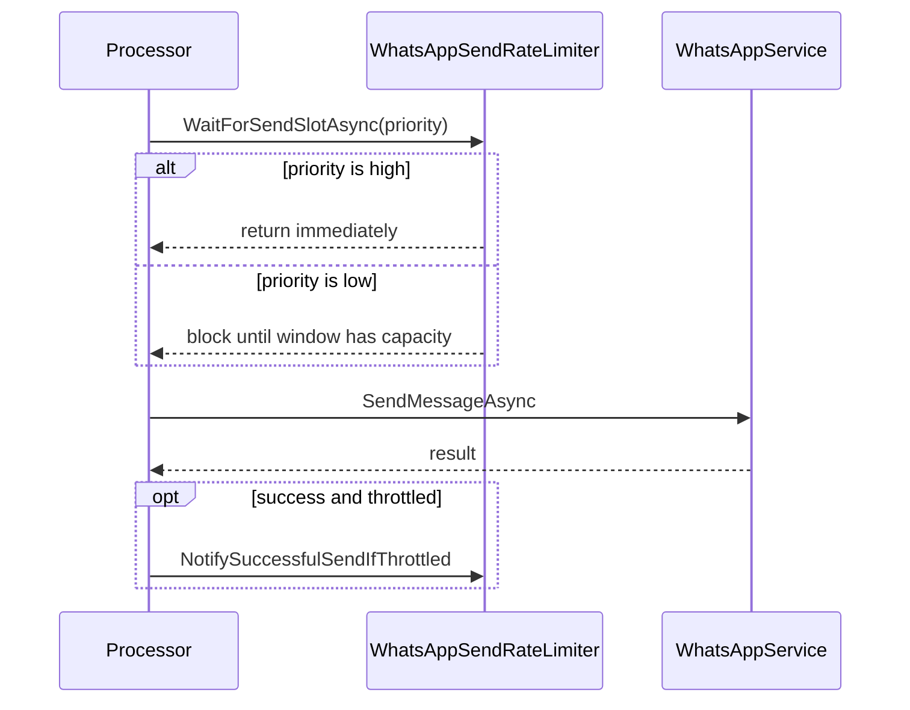
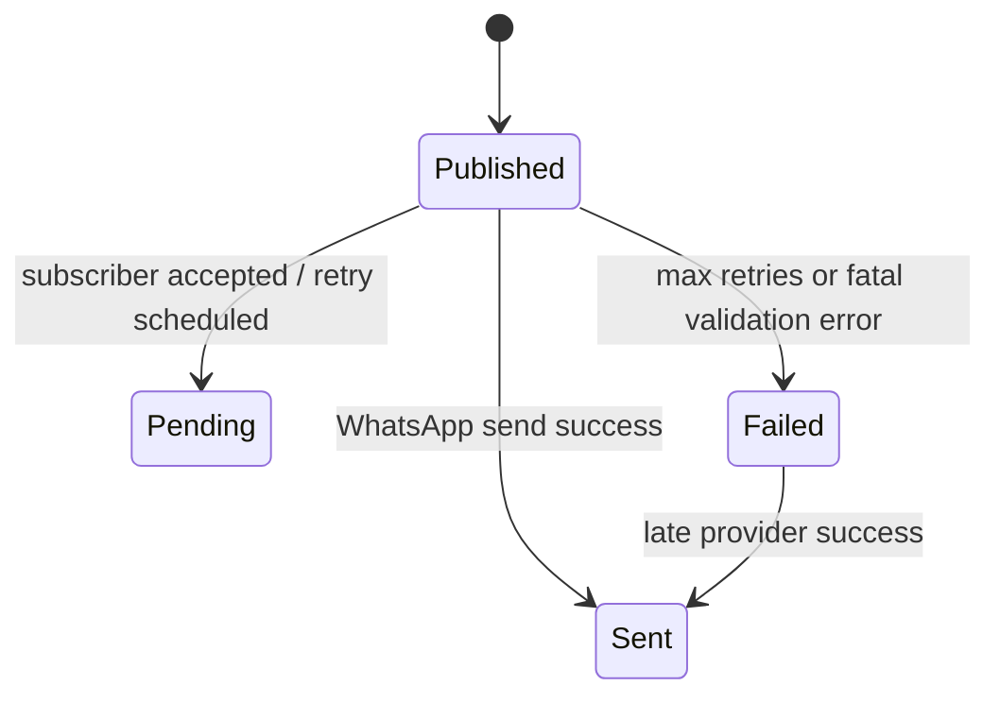

# Runtime Flow and Processing Behavior

This document explains the **actual runtime behavior** of the current branch,
including startup/shutdown, message processing flow, retry semantics, and
concurrency boundaries.

---

## 1) Startup and shutdown

The app is hosted with `.NET Generic Host`:

1. `Program.cs` builds the DI container and validates options at startup.
2. A broker-specific `IMessageProcessor` implementation is resolved.
3. `ProcessorHostedService.StartAsync` starts broker consumption loops.
4. On shutdown (`SIGTERM`, Ctrl+C, orchestrator stop), the host calls
   `ProcessorHostedService.StopAsync`, which awaits `processor.CloseAsync()`.

This means the service is container-friendly and no longer relies on
`Console.ReadKey()`.

---

## 2) Concurrency model (important)

### Broker-level concurrency

- **Service Bus:** `MessageHandlerOptions.MaxConcurrentCalls` can dispatch
  multiple callback invocations.
- **Redis Streams:** multiple entries can be read and processed in parallel,
  bounded by `Redis.MaxConcurrentCalls`.

### WhatsApp send concurrency

Both processors call the same Selenium-based `IWhatsAppService`. Because one
browser driver session is not safe for concurrent send operations, each
processor wraps `SendMessageAsync` in a process-local `SemaphoreSlim(1,1)`.

**Result:** fetch/decode/ack logic can run in parallel, but actual WhatsApp
sends are one-at-a-time per process.

### WhatsApp send rate limit (low priority)

Before entering the exclusive Selenium send semaphore, both processors await
`IWhatsAppSendRateLimiter.WaitForSendSlotAsync(dispatchPriority)`. Topics/streams
with `Priority >= WhatsAppSendRateLimit:HighPriorityLessThan` (default **10**)
reserve at most **`MaxSendsPerMinute`** send slots per rolling minute (default
**20**). Lower numeric priorities (e.g. `0` for auth) bypass the wait. The slot
is reserved before the browser lock is entered so concurrent waiters cannot
oversubscribe the cap. Waiting outside the semaphore prevents a throttled
low-priority message from holding the browser lock while a high-priority message
is ready.

---

## 3) Service Bus flow

1. Message handler receives a message.
2. Processor validates required metadata (`MessageName`, type, body format).
3. Optional attachment is downloaded from blob storage.
4. WhatsApp send is executed under serialized access.
5. Outcome:
   - success → `CompleteAsync`
   - failure/exception → `AbandonAsync`
   - max retry reached / invalid payload → `DeadLetterAsync`

### Retry semantics

Service Bus retry delay is controlled by Service Bus delivery/lock behavior.
The app does not schedule delayed retries directly for Service Bus.

---

## 4) Redis Streams flow

Per stream, three loops run:

1. **Main read loop** (`XREADGROUP`) for new messages.
2. **Retry scheduler loop** that promotes due entries from `:retries` sorted
   set back into the main stream.
3. **Pending reclaim loop** (`XAUTOCLAIM`) for stale in-flight messages.

Each message is validated, sent (serialized Selenium access), then:

- success → `XACK`
- failure/exception → `XACK` + delayed retry into `:retries`
- max retries/invalid payload → write to `:dead` and `XACK`

---

## 5) Message tracking behavior

`MessageTrackingService` now fails fast on bad configuration:

- missing `MessageTracking` section
- empty `NotificationSecret`
- invalid/non-absolute `ApiUrl`

The worker reports delivery callbacks using:

- header `X-Notification-Secret`
- snake_case JSON: `message_id` (backend UUID when present in payload), `status`,
  optional `provider_message_id`, `delivered_at` (UTC `yyyy-MM-dd HH:mm:ss` for **Sent** — MySQL-friendly), and required
  `error_message` for **Failed**

At runtime it now emits only backend-supported statuses:

- `Pending` (accepted or queued for retry)
- `Sent` (success)
- `Failed` (terminal failure, dead-letter, or invalid payload)

---

## 6) Operational guidance

- Keep `MaxConcurrentCalls` aligned with infrastructure capacity, but remember
  Selenium sends remain serialized.
- For higher throughput, scale horizontally with multiple worker instances,
  each with its own browser profile/session.
- Prefer structured logging and metrics before production rollout to improve
  troubleshooting of reclaim/retry interactions.
